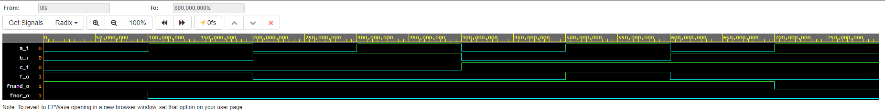

## Nadpis 2
https://www.edaplayground.com/x/E8RC

#### De Morgan's laws simulation
```vhdl
architecture dataflow of gates is
begin
    f_o  <= ((not b_i) and a_i) or ((not c_i) and (not b_i));
end architecture dataflow;
```

