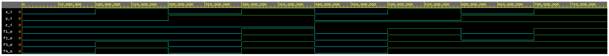

## 1. GitHub link
https://github.com/xhrube05/Digital-electronics-1

## 2. De Morgan's laws simulation
### VHDL code
```vhdl
architecture dataflow of gates is
begin
    f_o     <= ((not b_i) and a_i) or ((not c_i) and (not b_i));
    fnand_o <= not(not((not b_i) and a_i) and (not((not c_i) and (not b_i))));
    fnor_o  <= not(b_i or (not a_i)) or (not(c_i or b_i));

end architecture dataflow;
```
### Screenshot

### EDA playground link
https://www.edaplayground.com/x/Bx5U
### Table
| **c** | **b** |**a** | **f(c,b,a)** | 
| :-: | :-: | :-: | :-: | 
| 0 | 0 | 0 | 1 | 
| 0 | 0 | 1 | 1 | 
| 0 | 1 | 0 | 0 | 
| 0 | 1 | 1 | 0 | 
| 1 | 0 | 0 | 1 | 
| 1 | 0 | 1 | 0 | 
| 1 | 1 | 0 | 0 | 
| 1 | 1 | 1 | 0 | 

## 3. Distributive laws
### VHDL code
```vhdl
architecture dataflow of gates is
begin
    f1_o <= (x_i and y_i) or (x_i and z_i);
    f2_o <= (x_i and (y_i or z_i));
    f3_o <= (x_i or y_i) and (x_i or z_i);
    f4_o <= x_i or (y_i and z_i);
end architecture dataflow;
```
### Screenshot

### EDA playground link
https://www.edaplayground.com/x/NjeC
