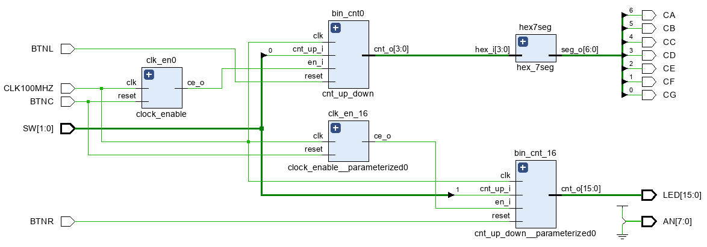

## 1. Preparation tasks
### Figure with connection of push buttons on Nexys A7 board

### Table with calculated values
| **Time interval** | **Number of clk periods** | **Number of clk periods in hex** | **Number of clk periods in binary** |
| :-: | :-: | :-: | :-: |
| 2ms | 200 000 | `x"3_0d40"` | `b"0011_0000_1101_0100_0000"` |
| 4ms | 400 000 | `x"6_1A80"` | `b"0110_0001_1010_1000_0000"` |
| 10ms | 1 000 000 | `x"F_4240"` | `b"1111_0100_0010_0100_0000"` |
| 250ms | 25 000 000 | `x"17D_7840"` | `b"0001_0111_1101_0111_1000_0100_0000"` |
| 500ms | 50 000 000 | `x"2FA_F080"` | `b"0010_1111_1010_1111_0000_1000_0000"` |
| 1sec | 100 000 000 | `x"5F5_E100"` | `b"0101_1111_0101_1110_0001_0000_0000"` |

## 2. Bidirectional counter
### VHDL code (`cnt_up_down.vhd`)
```vhdl
 p_cnt_up_down : process(clk)
    begin
        if rising_edge(clk) then         
            if (reset = '1') then               -- Synchronous reset
                s_cnt_local <= (others => '0'); -- Clear all bits 
            elsif (en_i = '1') then             -- Test if counter is enabled
                if (cnt_up_i = '1') then         
                    s_cnt_local <= s_cnt_local + 1;
                else
                    s_cnt_local <= s_cnt_local - 1;
                end if; 
            end if;
        end if;
    end process p_cnt_up_down;
```
### VHDL reset and stimulus processes(`tb_cnt_up_down.vhd`)
```vhdl
    --------------------------------------------------------------------
    -- Reset generation process
    --------------------------------------------------------------------
    p_reset_gen : process
    begin
        s_reset <= '0';
        wait for 12 ns;
        
        -- Reset activated
        s_reset <= '1';
        wait for 73 ns;

        s_reset <= '0';
        wait;
    end process p_reset_gen;

    --------------------------------------------------------------------
    -- Data generation process
    --------------------------------------------------------------------
    p_stimulus : process
    begin
        report "Stimulus process started" severity note;

        -- Enable counting
        s_en     <= '1';
        
        -- Change counter direction
        s_cnt_up <= '1';
        wait for 380 ns;
        s_cnt_up <= '0';
        wait for 220 ns;

        -- Disable counting
        s_en     <= '0';

        report "Stimulus process finished" severity note;
        wait;
    end process p_stimulus;
```
### Screenshot with simulated time waveforms
#### Whole waveform

#### Closeup waveform


## 3. Top level
### VHDL code (`top.vhd`)
```vhdl
library IEEE;
use IEEE.STD_LOGIC_1164.ALL;

-- Uncomment the following library declaration if using
-- arithmetic functions with Signed or Unsigned values
--use IEEE.NUMERIC_STD.ALL;

-- Uncomment the following library declaration if instantiating
-- any Xilinx leaf cells in this code.
--library UNISIM;
--use UNISIM.VComponents.all;

entity top is
    Port ( 
           CLK100MHZ : in STD_LOGIC;
           BTNC      : in STD_LOGIC;
           BTNL      : in STD_LOGIC;
           BTNR      : in STD_LOGIC;
           
           SW        : in STD_LOGIC_VECTOR (2-1 downto 0);
           LED       : out STD_LOGIC_VECTOR (16-1 downto 0);
           
           CA        : out STD_LOGIC;
           CB        : out STD_LOGIC;
           CC        : out STD_LOGIC;
           CD        : out STD_LOGIC;
           CE        : out STD_LOGIC;
           CF        : out STD_LOGIC;
           CG        : out STD_LOGIC;
           
           AN        : out STD_LOGIC_VECTOR (8-1 downto 0));
end top;

------------------------------------------------------------------------
-- Architecture body for top level
------------------------------------------------------------------------
architecture Behavioral of top is

    -- Internal clock enable
    signal s_en  : std_logic;
    -- Internal counter
    signal s_cnt : std_logic_vector(4-1 downto 0);
    
    -- 16
    signal s_en16  : std_logic;
    -- Internal counter
    signal s_cnt16 : std_logic_vector(16-1 downto 0);

begin

    --------------------------------------------------------------------
    -- Instance (copy) of clock_enable entity
    clk_en0 : entity work.clock_enable
        generic map(
            --- WRITE YOUR CODE HERE
            g_MAX => 100000000
        )
        port map(
            --- WRITE YOUR CODE HERE
            clk    => CLK100MHZ,
            reset  => BTNC,
            ce_o   => s_en
        );

    --------------------------------------------------------------------
    -- Instance (copy) of cnt_up_down entity
    bin_cnt0 : entity work.cnt_up_down
        generic map(
            --- WRITE YOUR CODE HERE
            g_CNT_WIDTH => 4
        )
        port map(
            --- WRITE YOUR CODE HERE
            clk      =>  CLK100MHZ,
            reset    =>  BTNL,
            en_i     =>  s_en,
            cnt_up_i =>  SW(0),
            cnt_o    =>  s_cnt
        );

    -- 16 bit counter
    clk_en_16 : entity work.clock_enable
        generic map(
            g_MAX   =>  1000000
        )        
        port map(
            clk     =>  CLK100MHZ,
            reset   =>  BTNC,
            ce_o    =>  s_en16
        );
    bin_cnt_16 : entity work.cnt_up_down
        generic map(
            g_CNT_WIDTH =>  16
        )
        port map(
            clk         =>  CLK100MHZ,
            reset       =>  BTNR,
            en_i        =>  s_en16,
            cnt_up_i    =>  SW(1),
            cnt_o       =>  s_cnt16
        );

    -- Display input value on LEDs
    LED(16-1 downto 0) <= s_cnt16;

    --------------------------------------------------------------------
    -- Instance (copy) of hex_7seg entity
    hex7seg : entity work.hex_7seg
        port map(
            hex_i    => s_cnt,
            seg_o(6) => CA,
            seg_o(5) => CB,
            seg_o(4) => CC,
            seg_o(3) => CD,
            seg_o(2) => CE,
            seg_o(1) => CF,
            seg_o(0) => CG
        );

    -- Connect one common anode to 3.3V
    AN <= b"1111_1110";

end architecture Behavioral;
```
### Image of the top layer including both counters, ie a 4-bit bidirectional counter from Part 4 and a 16-bit counter
#### Schema in vivado (RTL Analysis)

