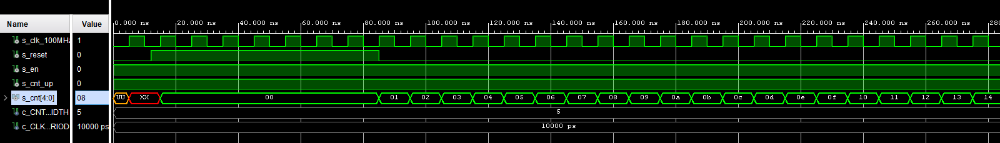

## 1. Preparation tasks
### Figure with connection of push buttons on Nexys A7 board

### Table with calculated values
| **Time interval** | **Number of clk periods** | **Number of clk periods in hex** | **Number of clk periods in binary** |
| :-: | :-: | :-: | :-: |
| 2ms | 200 000 | `x"3_0d40"` | `b"0011_0000_1101_0100_0000"` |
| 4ms | 400 000 | `x"6_1A80"` | `b"0110_0001_1010_1000_0000"` |
| 10ms | 1 000 000 | `x"F_4240"` | `b"1111_0100_0010_0100_0000"` |
| 250ms | 25 000 000 | `x"17D_7840"` | `b"0001_0111_1101_0111_1000_0100_0000"` |
| 500ms | 50 000 000 | `x"2FA_F080"` | `b"0010_1111_1010_1111_0000_1000_0000"` |
| 1sec | 100 000 000 | `x"5F5_E100"` | `b"0101_1111_0101_1110_0001_0000_0000"` |

## 2. Bidirectional counter
### VHDL code (`cnt_up_down.vhd`)
```vhdl
 p_cnt_up_down : process(clk)
    begin
        if rising_edge(clk) then         
            if (reset = '1') then               -- Synchronous reset
                s_cnt_local <= (others => '0'); -- Clear all bits 
            elsif (en_i = '1') then             -- Test if counter is enabled
                if (cnt_up_i = '1') then         
                    s_cnt_local <= s_cnt_local + 1;
                else
                    s_cnt_local <= s_cnt_local - 1;
                end if; 
            end if;
        end if;
    end process p_cnt_up_down;
```
### VHDL reset and stimulus processes(`tb_cnt_up_down.vhd`)
```vhdl
    --------------------------------------------------------------------
    -- Reset generation process
    --------------------------------------------------------------------
    p_reset_gen : process
    begin
        s_reset <= '0';
        wait for 12 ns;
        
        -- Reset activated
        s_reset <= '1';
        wait for 73 ns;

        s_reset <= '0';
        wait;
    end process p_reset_gen;

    --------------------------------------------------------------------
    -- Data generation process
    --------------------------------------------------------------------
    p_stimulus : process
    begin
        report "Stimulus process started" severity note;

        -- Enable counting
        s_en     <= '1';
        
        -- Change counter direction
        s_cnt_up <= '1';
        wait for 380 ns;
        s_cnt_up <= '0';
        wait for 220 ns;

        -- Disable counting
        s_en     <= '0';

        report "Stimulus process finished" severity note;
        wait;
    end process p_stimulus;
```
### Screenshot with simulated time waveforms
#### Whole waveform

#### Closeup waveform


## 3. Top level
### VHDL code (`top.vhd`)
```vhdl
```
### Image of the top layer including both counters, ie a 4-bit bidirectional counter from Part 4 and a 16-bit counter with a different time base from Part Experiments on your own. The image can be drawn on a computer or by hand
