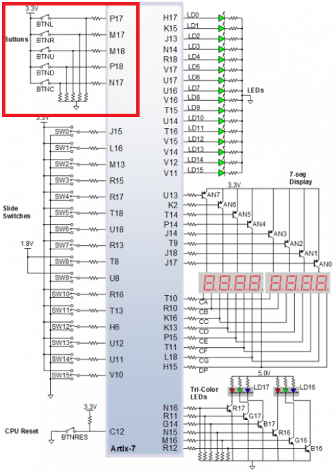

## 1. Preparation tasks
### Figure with connection of push buttons on Nexys A7 board

### Table with calculated values
| **Time interval** | **Number of clk periods** | **Number of clk periods in hex** | **Number of clk periods in binary** |
| :-: | :-: | :-: | :-: |
| 2ms | 200 000 | `x"3_0d40"` | `b"0011_0000_1101_0100_0000"` |
| 4ms | 400 000 | `x"6_1A80"` | `b"0110_0001_1010_1000_0000"` |
| 10ms | 1 000 000 | `x"F_4240"` | `b"1111_0100_0010_0100_0000"` |
| 250ms | 25 000 000 | `x"17D_7840"` | `b"0001_0111_1101_0111_1000_0100_0000"` |
| 500ms | 50 000 000 | `x"2FA_F080"` | `b"0010_1111_1010_1111_0000_1000_0000"` |
| 1sec | 100 000 000 | `x"5F5_E100"` | `b"0101_1111_0101_1110_0001_0000_0000"` |