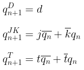
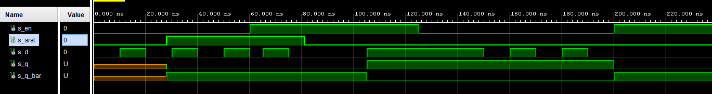

## 1. Preparation tasks
### Characteristic equations and completed tables for D, JK, T flip-flops


| **D** | **Qn** | **Q(n+1)** | **Comments** |
| :-: | :-: | :-: | :-- |
| 0 | 0 | 0 | No change |
| 0 | 1 | 0 | Change |
| 1 | 1 | 1 | No change |
| 1 | 0 | 1 | Change |

| **J** | **K** | **Qn** | **Q(n+1)** | **Comments** |
| :-: | :-: | :-: | :-: | :-- |
| 0 | 0 | 0 | 0 | No change |
| 0 | 0 | 1 | 1 | No change |
| 0 | 1 | 0 | 0 | Reset |
| 0 | 1 | 1 | 0 | Reset |
| 1 | 0 | 0 | 1 | Set |
| 1 | 0 | 1 | 1 | Set |
| 1 | 1 | 0 | 1 | Toggle |
| 1 | 1 | 1 | 0 | Toggle |

| **T** | **Qn** | **Q(n+1)** | **Comments** |
| :-: | :-: | :-: | :-- |
| 0 | 0 | 0 | No change |
| 0 | 1 | 1 | No change |
| 1 | 0 | 1 | Toggle |
| 1 | 1 | 0 | Toggle |
 
## 2. D latch
### VHDL code listing of the process (`p_d_latch`)
```vhdl
p_d_latch : process (d, arst, en)
begin
    if (arst='1') then
        q     <= '0';
        q_bar <= '1';
        
    elsif (en='1') then
        q     <= d;
        q_bar <= not d;    
    end if;
end process p_d_latch;
```
### VHDL reset and stimulus processes (`tb_d_latch`)
```vhdl
  -- reset generation process
  p_reset_gen: process
  begin
        s_arst <= '0';
        wait for 28 ns;
        -- reset activated
        s_arst <= '1';
        wait for 53ns;
        -- reset deactivated
        s_arst <= '0';
        wait for 660ns;
        s_arst <= '1';
        wait;
  end process p_reset_gen;

  -- data generation process
  p_stimulus : process
    begin
        report "Stimulus process started" severity note;
        s_en    <= '0';
        s_d     <= '0';

        wait for 10 ns;
        s_d <= '1';
        wait for 10 ns;
        s_d <= '0';
        wait for 10 ns;
        s_d <= '1';
        wait for 10 ns;
        s_d <= '0';
        wait for 10 ns;
        s_d <= '1';
        wait for 10 ns;
        s_d <= '0';

        s_en <= '1'; wait for 5 ns;
        assert(s_q = '0' and s_q_bar = '1')
        report "expected: s_q 0, q_bar 1" severity error;
        
        s_d <= '1';
        wait for 10 ns;
        s_d <= '0';
        wait for 10 ns;
        s_d <= '0';
        wait for 10 ns;
        s_d <= '0';
        wait for 10 ns;
        s_d <= '1';
        wait for 10 ns;
        s_d <= '1';
        wait for 10 ns;
        s_d <= '1';
        
        s_en <= '0'; wait for 5 ns;
        assert(s_q = '1' and s_q_bar = '0') 
        report "expected: asrt 1" severity error;
        
        wait for 10 ns;
        s_d <= '1';
        wait for 10 ns;
        s_d <= '0';
        wait for 10 ns;
        s_d <= '1';
        wait for 10 ns;
        s_d <= '0';
        wait for 10 ns;
        s_d <= '1';
        wait for 10 ns;
        s_d <= '0';
        wait for 10 ns;
        s_d <= '0';      
        
        s_en <= '1'; wait for 5 ns;
        assert(s_q = '0' and s_q_bar = '1') 
        report "expected: asrt 1" severity error;
     
        report "Stimulus process finished" severity note;
        
        wait;
    end process p_stimulus;
```
### Screenshot with simulated time waveforms

 
## 3. Flip-flops
### VHDL code listing of the processes (`p_d_ff_arst`, `p_d_ff_rst`, `p_jk_ff_rst`, `p_t_ff_rst`)
```vhdl
```
### Listing of VHDL clock, reset and stimulus processes from the testbench
```vhdl
```
### Screenshot with simulated time waveforms

 
## 4. Shift register
### Image of the shift register schematic 
